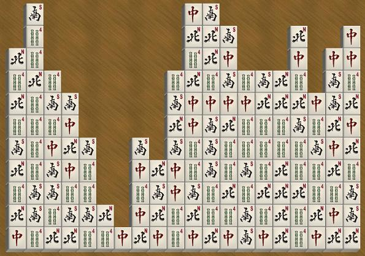



## DirectX MahJong Game

### Description

Finally, I was able to upload the game along with big graphics files. Don't try to study the code because it is poorly written. Anyway, check it out and play it just for fun!
 
### More Info
 

             |
---                |---
**Submitted On**   |2005-02-23 21:45:24
**By**             |[Min Thant Sin](https://github.com/Planet-Source-Code/PSCIndex/blob/master/ByAuthor/min-thant-sin.md)
**Level**          |Intermediate
**User Rating**    |5.0 (15 globes from 3 users)
**Compatibility**  |VB 6\.0
**Category**       |[Games](https://github.com/Planet-Source-Code/PSCIndex/blob/master/ByCategory/games__1-38.md)
**World**          |[Visual Basic](https://github.com/Planet-Source-Code/PSCIndex/blob/master/ByWorld/visual-basic.md)
**Archive File**   |[DirectX\_Ma1875704112005\.zip](https://github.com/Planet-Source-Code/min-thant-sin-directx-mahjong-game__1-51644/archive/master.zip)

